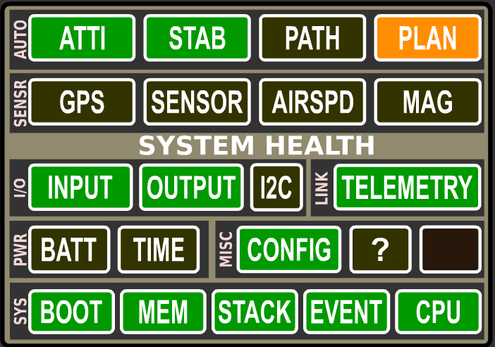

Alarms - What they mean and how to fix them
===========================================

Status widget overview
----------------------

The OpenPilot/LibrePilot flight control firmware has a built-in status system
that gives you an overview about what's happening with the board. The System
Health Status widget in the Ground Control Station can be used to diagnose
various problems, and to check which modules of the firmware are running.

.. rubric:: Arming

The flight control board cannot be armed until crossed-out alarms and red
alarms have been solved. All objects, except for the special "Plan", should be
green for optimal flight performance. The information corresponds to the
UAVObject **DataObjects > SystemAlarms > Alarm**.

Status object explanations
--------------------------

Auto (Autonomous)
^^^^^^^^^^^^^^^^^

Atti
""""

Shows the status of the board's attitude data. If all is well with gyroscope
and accelerometer, it turns green after gyroscope calibration upon power up, or
if you are using "**GPS Navigation (INS13GPSOutdoor)**" stabilization mode, when
the Inertial Navigation System's **Extended Kalman Filter (EKF)** has fired up.
EKF is a sophisticated sensor fusion algorithm that takes data from relevant
sensors and creates a best possible estimation of the board's angle, velocity
and position.

* |atti-err| Attitude data not available, waiting for gyroscope calibration.
  Don't move the vehicle while gyros are being calibrated upon board power-up.
  There is no data coming in from the sensors, which usually indicates faulty
  onboard sensors on CC3D and unknown home location on Revo. For Revo this is
  normal when you have not had GPS fix yet on a new build. The home location
  will be automatically set when GPS gets enough satellites and good fix.
  The sensors can be damaged in a bad crash. Otherwise, contact board seller.
* |atti-crit| Data is received from the sensors, but attitude information is not
  available. This usually happens when the EKF is not running yet. Make sure
  that GPS and MAG alarms are green, and that all calibrations have been done
  properly. It sometimes helps to move the vehicle around a bit to give EKF a
  better view of what's going on with sensors.
* |atti-warn| EKF is running, but the state estimation is not optimal. Good
  calibration and moving the vehicle a bit helps this situation.
* |atti-ok| The system has a clear view of the state of the vehicle.

.. rubric:: "The Bug"

There is a very specific condition that can arise within the system that can
sometimes occur after the EKF has been initialised, and the vehicle has been
left stationary for an extended period of time.

Fortunately this condition is easily detected and the flight firmware mitigates
the event. However, the solution is extremely complicated and beyond the
capability of most people, and until such stage as the developers have a chance
to address the matter, it's occurrence is indicated as follows:

* A large red X appears over the PFD.
* A Yellow ATTI alarm with STAB green

This event has been nicknamed "The Bug", and it is still possible to arm and
fly the vehicle in this condition.

Should you wish to clear the indication, one can reset the Revolution flight
controller, or alternatively, change the Attitude Estimation Algorithm to
**Basic(Complementary)**, and then change back to **GPS Navigation(INS13)**.
This action will cause the EKF to reinitialise and the indications will be
cleared.

Stab
""""

   

Shows whether the board is capable of stabilizing flight. This status goes very
much hand in hand with Atti.

* |stab-err| Waiting for gyroscope calibration. Don't move the vehicle while
  gyros are being calibrated upon board power-up.
* |stab-crit| The stabilization module cannot stabilize flight. See red Atti status
  for explanation.
* |stab-warn| Can be a brief alarm when one gyroscope update is missng.
* |stab-ok| Stabilization of flight can be performed.

Path
""""

Shows whether the Revolution board is capable of autonomous path following.
Autonomous flight requires a GPS and a stabilization algorithm set up as GPS
navigation.

* |guid-off| The flight controller has not been configured to do autonomous
  flying. Autonomous flight is only possible with stabilization mode "GPS
  Navigation".
* |guid-crit| The system has been configured to initialize Path Follower module,
  but it can't be used at the moment. It happens usually because EKF is not
  running, see Atti red explanation.
* |guid-ok| All is good with the Path Follower module. You can use GPS flight
  modes.

Plan
""""

   

Shows the status of an autonomous flight plan that can be uploaded to Revolution
using the Ground Control Station. The status of Path remains yellow until a
proper plan has been uploaded, and turns green if all is good with the plan. A
valid plan can be activated with a path follower flight mode.

* |plan-off| The flight controller has not been configured to do autonomous
  flying. Autonomous flight is only possible with stabilization mode "GPS
  Navigation".
* |plan-crit| Path has been uploaded, but data is invalid and cannot be used for
  autonomous missions.
* |plan-warn| No path plan has been uploaded, but the system is ready to receive
  a plan. This is okay if you don't intend to do autonomous missions right now.
* |plan-ok| A valid and usable flight plan has been uploaded and stored on
  Revolution.

Sensor
^^^^^^

GPS
"""

Shows the status of the GPS that can be connected to an OpenPilot flight
controller. GPS is required for autonomous missions and more sophisticated
flight modes.

* |gps-off| A GPS has not been configured to be used.
* |gps-err| The GPS has been configured, but no valid data is coming in. This
  is normal if flight battery is not connected, because GPS only gets power
  from external sources, not USB. Check the baud rate and the used protocol of
  your GPS. Double check serial connection, TX/RX need to be crossed between
  board and GPS.
* |gps-crit| Serial communication is fine but the GPS has no valid fix. Wait for
  GPS to gather satellites, and preferably have your vehicle in an open area.
* |gps-warn| The GPS has a fix and navigation can be used. However, the position
  quality is very low (the indication <7 satellites and/or PDOP > 3.5m). A blue
  LED will flash on the OP v8 and v9 GPS.
* |gps-ok| The GPS has a valid 3D fix.

.. rubric:: Initial GPS setup information

When powering up the GPS for the first time, it might take over 30 minutes for
the GPS to download almanac information from the satellites and acquire a good
lock. Be patient, and have a clear view of the sky.

Sensor
""""""

Shows the status of the sensor handler module.

* |sens-off| Sensor module is not being used in current configuration.
* |sens-ok| Sensor communications are up and ok.

Airspd
""""""

Shows the status of an optional air speed sensor that can be used with fixed
wing aircraft.

* |airspd-ok| Airspeed sensor has not been configured to be used.
* |airspd-off| Valid data is coming in from the airspeed sensor.

Mag
"""

   

Shows the status of Revolution's magnetometer, or the status of an auxiliary
magnetometer on board the OpenPilot GPSv9 if the GPS is configured to be used.

* |mag-off| Magnetometer is not being used in current configuration, or
  auxiliary magnetometer is not feeding data. If using GPSv9, power up the
  board externally. :ref:`Home location has to be set <setting-home-location>`
  to enable magnetometer.

* |mag-crit| Data is coming from the magnetometer, but the readings are off by
  over 15%. This can be caused by various reasons:

  - Magnetometer has not been calibrated with current vehicle (or after recent
    modifications to vehicle)
  - There are high currents in wires, interfering with the magnetometer. Twist
    wires and route them away from magnetometer.
  - Calibration was properly done outside, away from metallic objects, but the
    vehicle is now inside in a different magnetic environment. This behavior
    is normal.

* |mag-warn| Magnetometer readings are off by over 5%.

* |mag-ok| Magnetometer is working properly and the quality of the
  measurements is good.

I/O (Input / Output)
^^^^^^^^^^^^^^^^^^^^

Input
"""""

   

Input module handles the data that is coming from your receiver.

* |input-crit| R/C input has not been configured. Use **Input tab** or
  **Transmitter Setup Wizard** to configure your radio channel inputs.
* |input-warn| No R/C input data. Power up receiver with the flight battery.
* |input-ok| Valid R/C input data is coming in.

Output
""""""

Output module takes motor speed and servo position data from stabilization
algorithms, and feeds it into output channels.

* |output-crit| Channel outputs have not been configured. Use **Vehicle Setup Wizard**
  to configure them automatically.
* |output-ok| Outputs are configured and can be updated.

I2C
"""

I2C is a bus that connects onboard or auxiliary sensors and handles the data
transmissions. I2C is designed for communications internal to a PCB, and does
not work well via wire connections. It is okay to use for LED controls and
similar functions, but is absolutely not recommended for flight-critical
sensor connections.

* |i2c-off| I2C module is not being used.
* |i2c-crit| I2C module is in error state.
* |i2c-ok| I2C communications are up and working properly.

Link
^^^^

Telemetry
"""""""""

Shows the status of Telemetry communications module

* |telemetry-crit| Telemetry module has encountered an error. Set up only one telemetry
  output port.
* |telemetry-ok| Telemetry data communications are working properly.

Pwr (Power)
^^^^^^^^^^^

Batt
""""

Battery status shows whether you have enough voltage in the battery to fly. Set
limits for this in FlightBatt (CHECK this) settings. It requires a battery
voltage sensor to work. Battery monitoring module can be enabled in system
settings' optional modules.

* *(BLACK)* Battery monitoring module is not enabled.
* *(RED)* Not enough battery voltage to safely take off. Default limit is
  3.1V/Cell.
* *(ORANGE)* Battery voltage is low, but flying is possible. Default limit is
  3.4V/Cell.
* *(GREEN)* Battery voltage is ok.

Time
""""

Shows whether you have enough energy in the battery left for flying, and
requires a battery voltage and current sensor to work. Currently has a bug when
not using a current sensor; set the battery capacity to 0. This disables the
estimated flight time counter and associated alarms.

* *(BLACK)* Battery monitoring module is not enabled, see above Batt
  explanation.
* *(RED)* Battery energy is low, flying cannot be performed safely.
* *(ORANGE)* Low amount of energy in the battery, flying is still possible.
* *(GREEN)* Good amount of energy left in the battery to fly.

Misc
^^^^

Config
""""""

Shows whether your flight controller board has been properly set up.

* *(RED)* Board configuration problem. If you have set up GPS modes (GPS
  Assist, PosHold, RTB) to one flight mode, then make sure that "GPS
  Navigation (INS13)" fusion algorithm is selected.

  CC3D can't use GPS Navigation (INS13) and do not support GPS Assisted modes.

  Select **GPS Navigation (INS13)** in **Config** > **Attitude tab** >
  **Parameters** > **Attitude Estimation Algorithm**.

* *(GREEN)* Board configuration ok.

Sys (System)
^^^^^^^^^^^^

Boot
""""

Shows that a board reboot is required, or fail-safe settings have been loaded
upon boot.

* *(RED)* Boot alarm can be caused by various reasons:

  - No valid telemetry option selected, so board will boot with default USB
    telemetry
  - Board init failed due to driver, module or RAM issues, and the board has
    been booted up in fail-safe state
  - Board has been put to safe mode by the user
  - Board needs a reboot after hardware configuration changes

* *(GREEN)* Flight controller booted up properly.

Mem
"""

Displays the status of remaining memory (RAM) that are used by processes
internal to the flight controller.

* *(RED)* Very low RAM left, flying cannot be done safely.
  Less than 40 bytes for CC/CC3D or 500 bytes for other boards.
* *(ORANGE)* Low amount of RAM left, flying can be done but don't enable more
  software modules. This is common with older flight controllers such as
  CopterControl.
  Less than 200 bytes for CC/CC3D or 1000 bytes for other boards.
* *(GREEN)* Sufficient amount of RAM left for system to operate and expand.

Stack
"""""

Shows the status of the microcontroller's stack, which is a place where
low-level functions store data.

* *(GREEN)* Stack status ok.

Event
"""""

Shows the status of event system. A very heavy load can cause the event system
to be overloaded.

* *(RED)* Event system error or overloaded. This can be caused by a bug or too
  high telemetry update rates when OPLink has low baud, for example.
* *(ORANGE)* Event system at high stress. See above.
* *(GREEN)* Event system ok.

CPU
"""

Indicates CPU load.

* *(RED)* CPU load is very high, flight cannot be performed safely.
* *(ORANGE)* CPU load is high, but flight can be performed. Don't enable more
  software modules like TPS or board rotation. Should only occurs for CC/CC3D.
* *(GREEN)* CPU load is at an acceptable level, and flying is safe.

