How to configure a GPS for CC3D
===============================

CC3D or Atom flight controllers do not support GPS functions such as Return
to base or Position Hold. The original CopterControl (CC) board does not have
memory left for GPS use.

The only purpose for GPS use is telemetry using radio modems (OPLink) or GPS
position send to OSD device.

NMEA is not supported anymore because is less memory efficient, this page only
refers to UBlox GPS and UBX protocol.

.. note:: Others boards like :doc:`Revolution <../revo/index>` support
   **auto-configuration** and **no need** this manual configuration using
   UCenter.
   
   This means also if you connect your 'CC3D GPS' to a Revolution board, your
   previous configuration is lost!

Prerequisites
-------------

* Download the UCenter software `here <https://www.u-blox.com/en/product/u-center-windows>`_,
  check Zip icon in bottom page.

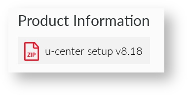

.. note:: UCenter is for Windows only.

* Install UCenter software
* Setup a serial connection with GPS using USB port (if any) or USBSerial
  (Gnd, +5V, Tx, Rx).

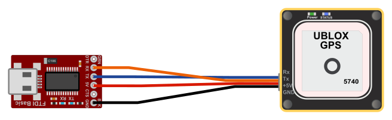

Configure your GPS
------------------

Connect
"""""""

* Connect GPS to USB serial or USB.
* Start UCenter software.

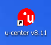

* Select COM port used for GPS.

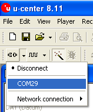

* Open console (F6 key) or **View** > **Packet Console** and check if link is
  correct, you should see messages output from GPS.

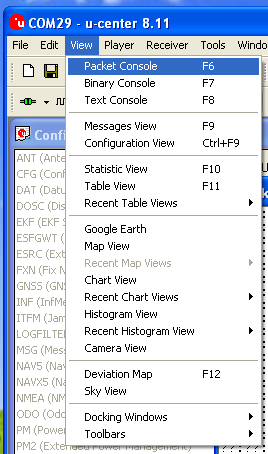

Reset to defaults
"""""""""""""""""

* Open Configuration View window: **View** > **Configuration View**.

* Reset current GPS config to defaults: Check **Revert to default configuration**.

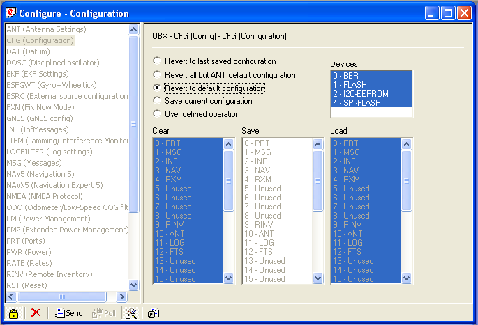

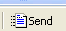

* Send config: |ucenter-send-config|

Select set of messages
""""""""""""""""""""""

* Open Messages View window: **View** > **Messages View**.

* **Disable** all active NMEA messages.

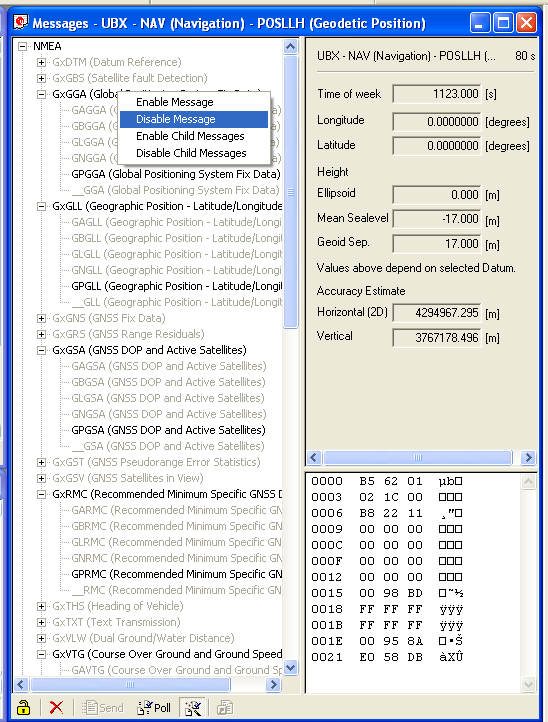

* **Enable** UBX messages needed:

  * **POSLLH**
  * **DOP**
  * **SOL**
  * **VELNED**

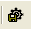

* Save current configuration using a little icon with a gear on top.
  |ucenter-save-config|

.. note:: Using this configuration you can't display satellite in GPS plugin
   because GPS don't send this data (usually SVINFO message).
   
   CC3D works only with minimal messages. (POSLLH, DOP, SOL, VELNED)

Setup port and protocol
"""""""""""""""""""""""

* Open Configuration View window: **View** > **Configuration View**.
  Move to **PRT (Ports)** in left column.

* Change message output in UART1: only UBX for protocol in/out.

* Change baudrate for UART1 port, same baudrate set for Flexi/Main GPS port.

.. caution:: You should use **9600** or **19200** baudrate for CC3D, or
   packets are dropped at higher speed. 

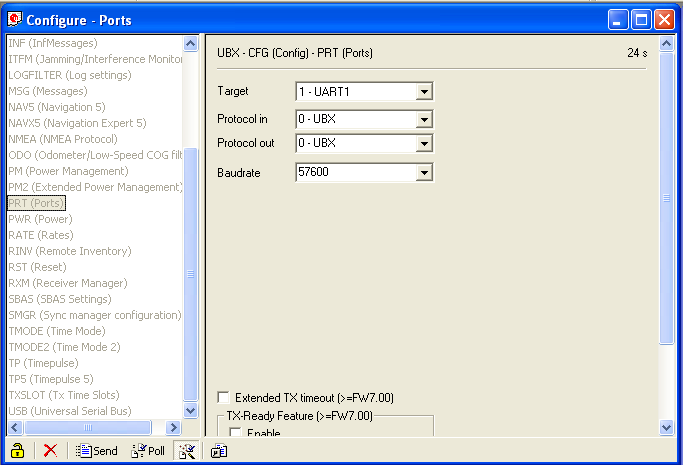

* Send config: |ucenter-send-config|

Change refresh rate and save
""""""""""""""""""""""""""""

* Move to **Rate (Rates)** in left column

* Change **Measurement Period** value to 200ms for a 5Hz refresh rate.

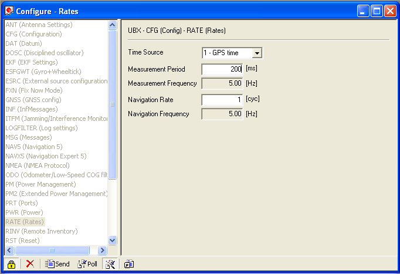

* Send config: |ucenter-send-config|

* Save current configuration: Check **Save current configuration**.

* All devices selected in blue.

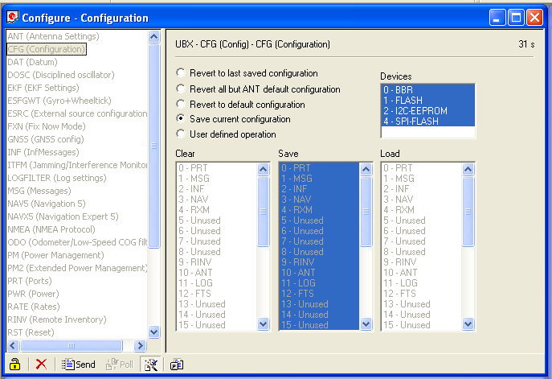

* Send config: |ucenter-send-config|
