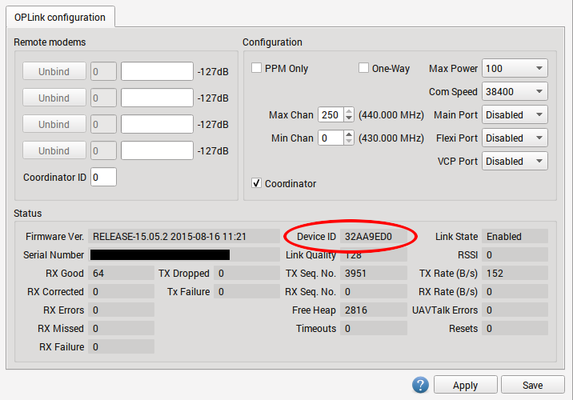
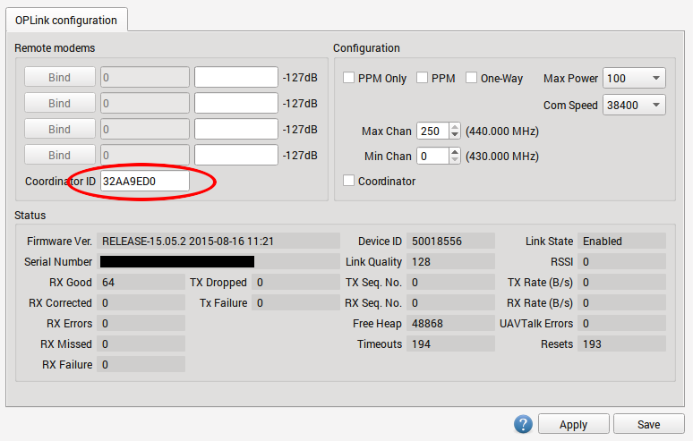
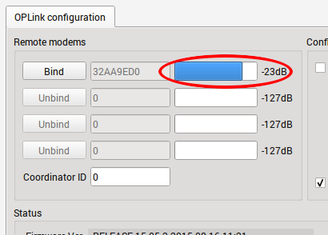

OPLM Binding and Basic Telemetry
--------------------------------

Summary
^^^^^^^

OPLink radios can be used in several different ways: for telemetry connection
only, for telemetry + vehicle control, and for vehicle control only. The common
thread for all these uses is *binding*, which also leads to basic telemetry
data being transmitted over the link automatically.

This procedure will bind an OPLink mini to another OPLink, either to the
integrated OPLink of the Revolution, or to another independent OPLink module.
If you are binding two stand-alone OPLink modules together, it is recommended
to first go through the :doc:`cc` page in order to prepare hardware for the
binding operation. For Revolution, port setup or hardware changes are not
necessary.

We will use the ground OPLink as a link coordinator, and the flight OPLink as
a link slave. This enables full telemetry capabilities and makes it possible
to use the link for vehicle control. **If you are going to use OPLink for**
**vehicle control, do this tutorial first, then proceed to the vehicle control**
**tutorial**. If you only intend to use telemetry, you can also make the flight
OPLink the coordinator, but this does not have any additional benefits.

Antennas
""""""""

.. caution:: From this point on, you should always have antennas connected to
   all OPLink modules. Neglecting this will cause permanent damage to the RF
   electronics.

Prerequisites
^^^^^^^^^^^^^

* Make sure that all modules are up to date by using the GCS Firmware Update &
  Erase feature, found in the Firmware tab. OPLink must be disconnected before
  clicking the update button. The OPLink that is integrated into Revolution will
  be updated when you update the flight controller firmware.
* If you are connecting a ground OPLink to another stand-alone module, set up
  the hardware first by following the :doc:`cc` page.
* To protect your hardware from short circuits, consider mounting the OPLink
  module inside a case or at least wrap it with heat shrink. **DO NOT** mount a
  bare board so that it can touch carbon fiber frame without insulating it first
  (carbon fiber is conductive).
* OpenPilot firmware can only support one Telemetry link at a certain time, so
  disable Telemetry going to OSD or Bluetooth module etc. **DO NOT** disable
  USBTelemetry.
* *Check, and* **re-check** *that there is an antenna connected to both OPLink*
  *modules!*

Binding
^^^^^^^

Coordinator side
""""""""""""""""

#. Connect to the OPLink module that you are going to use as Coordinator,
   usually the ground module.
#. Go to the OPLink page in the GCS, available on the Configuration tab's left
   bar. It is only visible if an OPLink or Revolution is connected.
#. Set the following recommended settings:

   #. "Max Power" **100** (or maximum for your country)
   #. "Com Speed" **38400**
   #. "Max chan" **250**
   #. "Min chan" **0**
   #. Tick the **Coordinator** checkbox
   #. Click **Save**, wait a few seconds for the telemetry gadget (the meter at
      the bottom of the GCS) to calm down.

#. Write down the Device ID. You are going to use it later.
#. Disconnect from the coordinating module.

The OPLink Save button will display a green "tick" when settings are saved, but
it can disappear soon after settings are saved. This is normal behavior.

.. rubric:: Using custom frequencies

If your country allows only a fraction of the available frequency band to be
used, you can adjust the operational OPLink channel range to reflect that. The
GCS indicates minimum and maximum used frequency when you change min and max
channels. Both OPLinks must have the same min and max channel pair to bind
successfully.

Slave side
""""""""""

#. Connect to the another OPLink device that is going to be the connection slave
#. On the OPLink page in the GCS, set exactly the same **Max Power**,
   **Com Speed**, **Max chan** and **Min chan** as you did for the Coordinator.
   **DO NOT** tick the "Coordinator" checkbox.
#. Enter the Device ID that you wrote down from Coordinator into the
   **Coordinator ID** text box.
#. Click **Save**, wait a few seconds for the telemetry gadget (the meter at
   the bottom of the GCS) to calm down.
#. Disconnect from the slave module. The bind is complete.

Testing the link for the first time
^^^^^^^^^^^^^^^^^^^^^^^^^^^^^^^^^^^

At this point, the OPLink modules have a successful bind and no more
configuration steps are needed. The next step is to actually test and verify
that the connection between the OPLink devices works properly. All OpenPilot
devices should be powered off and disconnected from your PC before testing.
This is because the modules need a proper power cycle to apply the changes we
made, and because only one telemetry connection can be supported at a time.
This means that if you have USB connected to the flight controller, only the
USB connection gets telemetry, and the OPLink does not.

#. Power on your vehicle using external power (i.e., a flight battery).
#. Connect to the ground module with USB and observe GCS behavior as
   communication link comes online. The link usually takes between 10 and 30
   seconds to establish, because there are a lot of settings objects that need
   to be downloaded through the link. You can observe the download process
   in System tab.
#. Go to the **OPLink Configuration** page, and you should see a blue bar in
   the **Remote modems** area, which indicates signal strength.

Congratulations! Your OPLink telemetry connection is now ready for use. If you
wish to use the connection for vehicle control also, proceed to the
:doc:`control` page.

Advanced topics
^^^^^^^^^^^^^^^

Binding to multiple vehicles
""""""""""""""""""""""""""""

You can use a single coordinator OPLink module to bind to multiple vehicles
that act as signal slaves. They cannot be powered on simultaneously, but this
allows you to get telemetry from many vehicles with just one ground module and
no configuration changes. It even supports controlling multiple vehicles. This
is established by repeating the slave side binding procedure for every
additional OPLink.

Multiple Slaves
"""""""""""""""

.. caution:: Use caution that only one vehicle at a time is powered with a
   flight battery, or you may have a second vehicle power up unexpectedly when
   you arm!
  
Using higher COM speed
""""""""""""""""""""""

OPLink supports higher COM speeds than 38400. If necessary, you can safely
bump it up to 57600. After that, the range of the link decreases significantly.
This makes it possible to transmit larger amounts of data and raise the update
periods of various data objects (manually, in data object meta data). With
faster data rate, ridiculous object update speeds can be achieved, but at the
cost of range.

Using Bluetooth module with OPLink
""""""""""""""""""""""""""""""""""

It is possible to connect a Bluetooth module to OPLink, and establish a
completely wireless telemetry link. In this setup, telemetry data is first
transmitted between OPLink modules, and then from ground OPLink module to
Bluetooth module, and finally a computer or a smartphone with integrated
Bluetooth chip. Setup instructions can be found in the :doc:`bluetooth` page.

One way operation
"""""""""""""""""

If for some reason you want to only transmit with the other module, and receive
with the other one, you can tick **"One way"** in both OPLink module settings.
It will enable a special mode where only the coordinator module can transmit
packets. The slave module receives packets normally.

Vehicle control link only
"""""""""""""""""""""""""

For those extra long or safety critical flights OPLink can be brought into a
special mode where nothing but PPM vehicle control signal is transmitted from
coordinator to slave. This enables a custom communication speed and protocol
in OPLink. You can enable it by ticking **"PPM Only"** at both OPLink module
configs. The control link has to be set up normally using :doc:`control` page
instructions.
