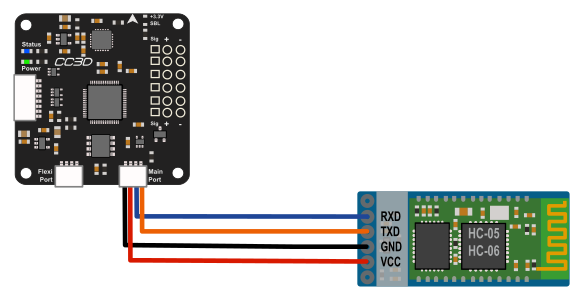
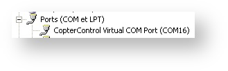
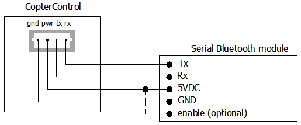
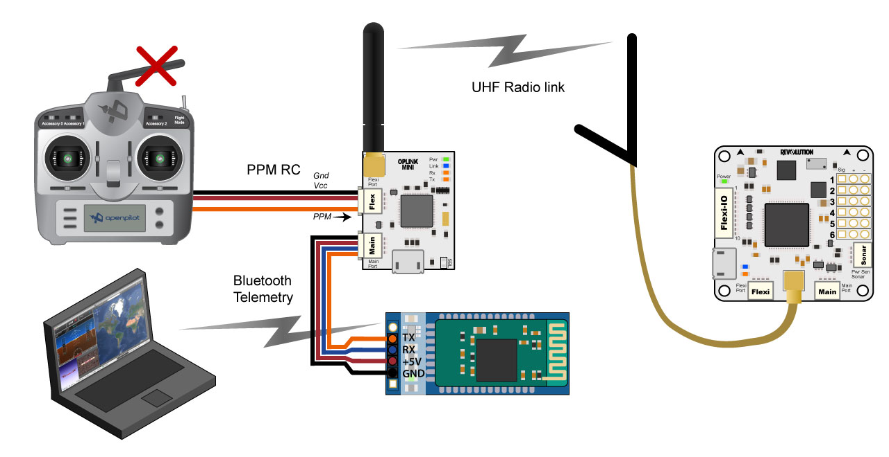

Bluetooth Setup for Telemetry
-----------------------------

Summary
^^^^^^^

These instructions will walk you through how to use a serial Bluetooth module,
such as HC-05 and HC-06, with OpenPilot hardware to establish a telemetry
connection. There are two ways to connect the module; either directly to the
flight controller, or to an OPLink ground module. Connecting to the flight
controller makes it possible to configure and calibrate the flight controller
near a PC or a smartphone, but as a Bluetooth connection does not travel long
distances, the link is usually lost during flight. OPLink solves this problem,
and communicates telemetry data from the vehicle to ground. Then Bluetooth
connection can be used to connect a PC or a smartphone to the OPLink ground
module. This is especially useful when using OPLink for vehicle control +
telemetry.

No matter which hardware configuration you choose, the Bluetooth module's
configuration procedure is basically the same. HC-05 and HC-06 Bluetooth
modules are factory configured to 9600 baud rate, 8 data bit, 1 stop bit and no
parity serial connection. The baud rate must be increased to 38400 to match with
that of the OPLink. Alternatively, 57600 baud can be used if you are connecting
the Bluetooth module directly to the flight controller, or if you use 57600 baud
with OPLink.

Configuring the Bluetooth module
^^^^^^^^^^^^^^^^^^^^^^^^^^^^^^^^

Hardware connections
""""""""""""""""""""

To change the baud rate of the Bluetooth module, you must connect to the module
with a serial link. You can either use an FTDI USB to serial adapter, or your
OpenPilot flight controller to connect to the Bluetooth module. Both establish
the same goal. If you have an FTDI adapter it is recommended to use that,
because it does not require any configuration steps like the flight controller
does for Virtual COM port ComBridge operation.

HW method 1: Using an FTDI adapter
""""""""""""""""""""""""""""""""""

.. image:: img/bt_connect.png

Most R/C hobbyists are familiar with FTDI USB to serial adapters. This is
probably the easiest method to connect to the Bluetooth module. An FTDI module
can easily be found on eBay.

#. Connect the wires according to the diagram.
#. Connect USB cable to the FTDI adapter.
#. Install any necessary `FTDI drivers <http://www.ftdichip.com/FTDrivers.htm>`_
   on your PC, or wait for your operating system to install them.
#. COM port becomes available automatically, and can be seen in the Windows
   Device Manager. Proceed to the next step below: **Software steps**.

HW method 2: Using the flight controller Virtual COM port
"""""""""""""""""""""""""""""""""""""""""""""""""""""""""

OpenPilot flight controllers can work as a USB-to-serial adapter with a feature
called Virtual COM port (VCP). The configuration for VCP ComBridge is fairly
straightforward. The VCP ComBridge feature works with all OpenPilot flight
controllers.

1. Connect the wires according to the diagram.
2. Connect USB cable to the flight controller.
3. Set the following settings:

   * USB VCP Function **ComBridge**
   * Main Port **ComBridge**
   * Speed **9600**

4. Click **Save**, and wait a few seconds for the changes to apply.
5. Reboot the flight controller, and the Virtual COM port should appear in the
   Windows Device Manager.

6. Proceed to the next step below: Software steps.

.. note:: To power up the Bluetooth chip for configuration, the flight
   controller has to be powered up externally, with a flight battery and
   UBEC, for example.
   
Software steps
^^^^^^^^^^^^^^

In this section, the Bluetooth module will be configured to correct the baud
rate. You can also customize the Bluetooth unit's name. The Bluetooth module
expects to be called AT commands in the COM port, which you can either write in
a command line, or automatically send with a Windows tool that former OpenPilot
developer PT_Dreamer wrote. Connect your Bluetooth module to your PC with either
the FTDI or VCP ComBridge. VCP ComBridge usage requires external power to the
flight controller.

If you have not decided on the baud rate you want to use for the Bluetooth
module, now is the time. Recommended settings are 38400 for usage with OPLink
and 57600 for usage directly with your flight controller. Remember the setting,
it is a good idea to use a marker pen and write it on the Bluetooth module.

Configuration method 1: Windows configuration software
""""""""""""""""""""""""""""""""""""""""""""""""""""""

#. Download `Bluetooth configuration software by PT_Dreamer <https://forums.openpilot.org/topic/7337-bluetooth-module-configuration-software/>`_
   from the attachment below.
#. Extract the files and launch the configuration program by clicking on the
   .exe file.
#. Select **COM port** and baud **9600**, and click **Connect**.
#. Select the appropriate **Speed** (baud rate; i.e., 38400 or 57600), **Name**
   and **Pin** code.
#. Click **Write values**.
#. Configuration is done.
#. Undo the USB VCP ComBridge changes if you used a flight controller for the connection.

**Configuration software download**: :download:`/files/BT_Cong_Qt4.zip`

Configuration method 2: Command line
""""""""""""""""""""""""""""""""""""

While the configuration software above is by far the easiest method on a
Windows system, Mac and Linux users will have to use command line to configure
the Bluetooth module. There are many terminal applications you can choose from.
One option for Windows and Linux is `PuTTY <http://www.chiark.greenend.org.uk/~sgtatham/putty/download.html>`_,
and for Mac `CoolTerm <http://www.macupdate.com/app/mac/31352/coolterm>`_. No
matter which terminal application you use, connect to the COM port that the
FTDI or VCP ComBridge is in with 9600 baud rate, 8 data bit, 1 stop bit & no
parity serial connection.

When serial connection is open in the terminal application, proceed with the
following steps, all CAPS:

#. Send "**AT**", the module should answer OK.
#. Send "**AT+NAMEOpenPilot**", this sets the module's name to "OpenPilot".
#. Send "**AT+BAUD6**" for 38400 baud rate OR "**AT+BAUD7**" for 57600 baud
   rate.
#. Close the terminal application.
#. Configuration is done.
#. Undo the USB VCP ComBridge changes if you used a flight controller for the
   connection.

Connecting the Bluetooth module to OpenPilot devices
^^^^^^^^^^^^^^^^^^^^^^^^^^^^^^^^^^^^^^^^^^^^^^^^^^^^

Connecting directly to the flight controller
""""""""""""""""""""""""""""""""""""""""""""

For direct connection from the flight controller to the Bluetooth module, the
wiring is exactly the same as USB VCP ComBridge wiring. The flight controller
has to be configured to output telemetry data at the correct baud rate.

#. Connect the wiring according to the diagram above.
#. Connect the USB to your flight controller.
#. Navigate to the **Hardware** tab on the **Configuration** page in the
   OpenPilot GCS.
#. Select **Telemetry** in the port where your Bluetooth module is connected
   (usually **Main Port**).
#. Select **57600** (or another speed that your Bluetooth module is configured
   to) as **Speed**.
#. Click **Save** and wait a few seconds for changes to apply.
#. Disconnect from the flight controller. You are now ready to test the link.

Connecting to OPLink ground module
""""""""""""""""""""""""""""""""""

For completely wireless telemetry with OPLink and Bluetooth module, the wiring
has to be connected according to the diagram above. OPLink vehicle control is
not necessary for Bluetooth operation, but that is the most common use scenario.
Completely wireless telemetry also works with CC/CC3D/Atom, as long as the
flight side OPLink wiring has been configured using the :doc:`cc` instructions,
and you have a successful bind. When you have done the wiring, proceed with the
following steps. The baud rate of the Bluetooth module has to be the same as
the OPLink radio baud rate. Remember to power up the OPLink via Flexi or Main
port, because powering it from USB port redirects Telemetry temporarily to USB.

#. Connect your ground OPLink module to your PC with USB .
#. Navigate to the **OPLink** tab on the **Configuration** page in the
   OpenPilot GCS.
#. Select **Telemetry** in **Main Port** of the ground OPLink module.
#. Click **Save**, and wait a few seconds for the changes to apply.
#. Disconnect from the OPLink ground module. You are now ready to test the link.

.. todo:: FIXME: screenshot

Connecting to the flight controller via Bluetooth telemetry
^^^^^^^^^^^^^^^^^^^^^^^^^^^^^^^^^^^^^^^^^^^^^^^^^^^^^^^^^^^

Your Bluetooth telemetry link should now be ready to test.

.. important:: Power up all the related devices such as the flight controller
   and possible OPLink modules using external power and **not** USB. This is
   important, because if any OpenPilot device is connected via USB, other
   Telemetry connections will be temporarily disabled until the USB is
   unplugged.

Connect to the Bluetooth module using your computer's Bluetooth utilities.
Use a new Pin if you changed it, or the usual default of 1234.

#. Connect to the Bluetooth module using your computer's Bluetooth utilities.
   Use a new Pin if you changed it, or the usual default of 1234.
#. Launch the OpenPilot GCS and select a serial COM port from the connections
   drop-down menu in the bottom bar. Then click **Connect**. You might have to
   try multiple ports to find the right one. This is the COM port that your
   PC's internal Bluetooth chip automatically creates when connection to your
   Bluetooth module is established.
#. **Success!** In the example screenshot above, the GCS is talking to an
   OpenPilot Revolution via OPLink <-> Bluetooth connection that is available
   on Serial COM13 port. The COM port number will most likely be different
   for you.

.. todo:: FIXME: screenshots

Connecting
""""""""""

The OpenPilot GCS will not automatically connect to Bluetooth devices. The
connection has to be opened manually by selecting a COM port, and clicking
**Connect**.

*(Virtual Com Bridge information was based on an OP Forum post by Zucky)*

*Images was taken from LibrePilot Wiki*

