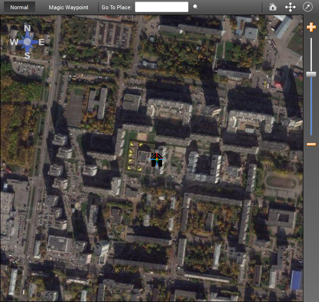
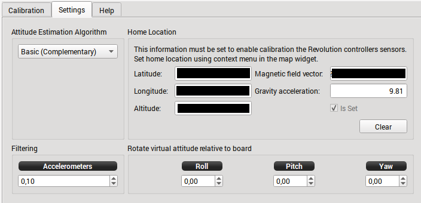

Revo - Sensor Calibration
=========================

Introduction
------------

.. todo:: screenshot

This panel will allow you to undertake a Manual Calibration of the Senors on
the Revolution board.

There is six (6) different Calibrations that can be preformed.

Steps:

* Setting Home Location
* Thermal Calibration
* Accelerometer Bias Calibration
* Magnetometer Calibration
* Board Level Calibration
* Gyro Bias Calibration

How to Video
------------

by Corvus Corax

`<https://vimeo.com/102013971>`_

Setting Home Location
---------------------

.. warning:: You must set your Home Location before performing the Sensor
   Calibrations

There is two ways of setting your home location:

#. Using GPS Module
#. Manually Select

* Go to Flight Data Tab
* Either wait for GPS to goto your Home Location (using GPS Module) or
  manually Zoom map up to your Location (Manual Select)
* Once found, right click on the map and click on "Set the Home Location"

* Enter the Altitude of your Home Location in metres, click "OK"

.. note:: You can check the Home Location coordinates by going the the
   Configuration Tab - Attitude/Settings tab

Thermal Calibration
-------------------

.. note:: The procedure below outlines the way to Thermally Calibrate the
   Revo to meet large temperature changes, it is not essential to put in
   the freezer as the min and max temp ranges of the calibration only need
   to be below and above the ambit temps of your location. 
   (approx +- 10/15deg c above and below)

   However if the temperature rises or falls above or below the min/max temps
   you calibrated at, you will need to redo this calibration, so it is best
   to use some form of cooling to lower the min start temp and raise above
   max ambit temps of your location.

   Also note this calibration is not needed, but will improve the performance
   of your board.
   
1. Plug your USB cable into your Revo. Start the OP GCS and ensure that you
   have disabled the OPLink modem (i.e. Max Power = 0). Then Save and
   Disconnect. Remove USB cable from computer but leave Revo plugged in.
2. Put your Revo in a plastic bag and seal it reasonably well, but with the
   USB cable exiting the baggie so it can be plugged in the computer.

.. note:: The bag is because we are going to freeze Revo and it will get condensation
   on it if we don't do this.

   For added temperature range (higher temperatures) you might build a very simple
   hot box out of a low wattage incandescent light and a shoe box. You also might
   consider just wrapping Revo up in a good insulator, like a warm lightweight
   modern jacket. You could also set it out in the hot sun in the summer if you
   can plug it into USB at the same time.

3. Put Revo/baggie/cable in the freezer for 20 minutes or so.
4. Take it out, put it in the hot box or wrapped up or in the sun, or not...
   Immediately start the Thermal Calibration.

   * Don't move it at all while calibrating is best (gyros and baro are being
     calibrated).
   * Don't allow your home heater or air conditioner fan to run while doing
     this is best (air pressure changes).
   * Don't open or close any doors in the house is best (air pressure changes).
   * Don't do this on a windy day (chimney, etc.).
   * Don't do this on a stormy day (rapid changes in barometer).
   * Don't play 1812 Overture or let your sister dance in the next room
     is best (:)).

.. note:: All these "is bests" aren't critical though. I understand that the 
   large number of samples taken masks a few bad samples.

5. Watch the Thermal calibration and unplug the light bulb when it gets within
   a few degrees of your desired high temperature (i.e. 10-15 deg above what
   hottest day in your location).
6. If it finishes Thermal calibration before reaching your desired temperature,
   you can start over or use what you have.
7. Save your Thermal calibration with the Save button in the lower right.

.. note:: You can check the temperature min-max (temp_calibrated_extent)
   Go to the System Tab then Settings/AccelGyroSettings/temp_calibrated_extent
   You can then see the min & max calibrated temps (below is screen shot of
   uncalibrated board showing 0 for both min & max, once calibrated you will
   see your boards min & max temps)

.. todo:: screenshot

Accelerometer Calibration
-------------------------

.. warning:: During this calibration the board MUST remain perfectly still
   during each position calibration. Even vibrations on a table or someone
   walking past could upset the calibration.

1. On the Calibration Tab, Click start "Accelerometer calibration".
2. Place the board as shown in the picture on screen and click "Save Position".

...

10. If the Calibration Failed, you will see above, you will need to restart
    the Accelerometer Calibration over.

