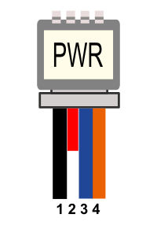
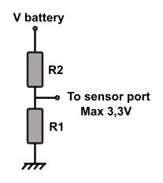
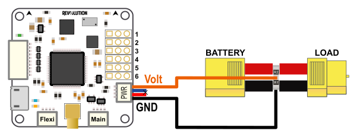
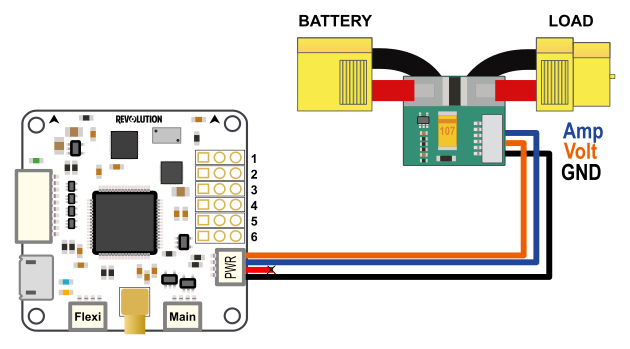
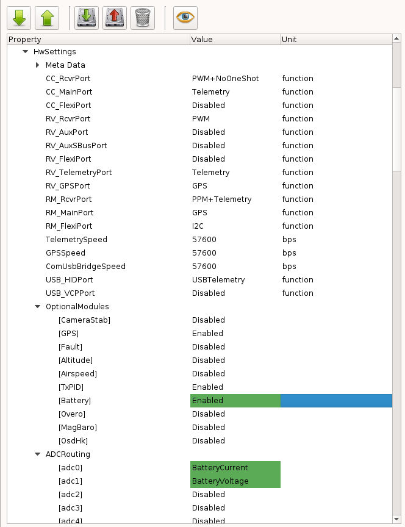
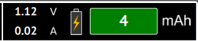
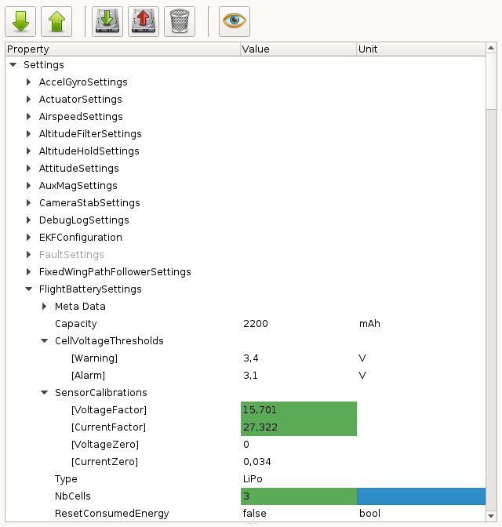

Revo - Current/Voltage Sensor Setup
===================================

Overview
--------

This page describes how to setup a voltage/current sensor using a Revolution
or Revolution Nano board.

Hardware Connections
--------------------

+--------+---------------+---------------+---------------+
| Color  | Connector pin | Description   | AttoPilot pin |
|        | (board)       |               | (sensor)      |
+========+===============+===============+===============+
| Black  | 1             | GND           | GND           |
+--------+---------------+---------------+---------------+
| Red    | 2             | Vcc           | Not used      |
+--------+---------------+---------------+---------------+
| Blue   | 3             | Current input | I             |
+--------+---------------+---------------+---------------+
| Orange | 4             | Voltage input | V             |
+--------+---------------+---------------+---------------+

Basic voltage sensor
--------------------

A basic voltage divider can be used, two resistors connected between
**ground** and **plus** from battery.

For a 4S battery (16.8Volts) the following values can be used:

* R1: 2,2 KOhms
* R2: 10 KOhms

With Vbattery = 16.8V, Vout = (16.8 * 2.2) / (10 + 2.2) =  3,03V

See also `<http://en.wikipedia.org/wiki/Voltage_divider>`_

Current / Voltage sensor
------------------------

Here is a list of common Attopilot sensors that can be used:

+--------------------------+----------------------+---------------+---------------+-------------+-------------+
| Module Type              | Sensitivity          | VoltageFactor | CurrentFactor | VoltageZero | CurrentZero |
+==========================+======================+===============+===============+=============+=============+
| Attopilot 13.6V/45A      | 242.3mV/V, 73.20mV/A | 4.127         | 13.661        | 0           | 0           |
+--------------------------+----------------------+---------------+---------------+-------------+-------------+
| Attopilot 50V/90A [#f1]_ | 63.69mV/V, 36.60mV/A | 15.701        | 27.322        | 0           | 0           |
+--------------------------+----------------------+---------------+---------------+-------------+-------------+
| Attopilot 50V/180A       | 63.69mV/V, 18.30mV/A | 15.701        | 54.645        | 0           | 0           |
+--------------------------+----------------------+---------------+---------------+-------------+-------------+

.. [#f1] Same as RCTIMER 90A current sensor

For custom sensor see the :ref:`calc_sensor_calibration` section.

Hardware settings
-----------------

The first thing to do is to configure the hardware settings:

#. Connect the board to your computer and got to the **System tab** in your
   GCS

#. Browse the first part (Settings) and find the **HwSettings** UAVObject

#. Enable the Battery module: **OptionalModules** > **Battery** >
   **Enable**

#. Set the analog input pins for voltage and current:

   * **ADCRouting** > **adc0** > **BatteryCurrent**
   * **ADCRouting** > **adc1** > **BatteryVoltage**

#. Save changes, click **Upload** button

#. Reboot your board: disconnect **all power sources** and reconnect to
   your computer.

Calibrate sensor
----------------

Now connect the battery to the battery sensor, if changes are done and
battery module enabled you can see the display on PFD:

But values displayed are not accurate, we need to calibrate sensor!

.. _calc_sensor_calibration:

Calculate SensorCalibration values
^^^^^^^^^^^^^^^^^^^^^^^^^^^^^^^^^^

To configure the battery monitor, you need to calculate the
**SensorCalibration** values.

For example, the documentation for Attopilot current sensor specifies
the following information for each sensor type:

+-----------+--------------+---------------+
| Sensor    | Voltage      | Current       |
| type      | sensitivity  | sensitivity   |
+===========+==============+===============+
| 50V/180A  | 63.69mV/Volt | 18.30mV / Amp |
+-----------+--------------+---------------+
| 50V/90A   | 63.69mV/Volt | 36.60mV / Amp |
+-----------+--------------+---------------+
| 13.6V/45A | 242.3mV/Volt | 73.20mV / Amp |
+-----------+--------------+---------------+

In order to use 50V/90A you'll have to do the following:

* Convert everything to Volt, so Volt/Volt and Volt/Amp:

   * 63.69mV/V / 1000 = 0.06369 V/V
   * 36.60mV/A / 1000 = 0.0366 V/A

* Then calculate the values to insert in **Voltage** and **Current Factors**:

   * **VoltageFactor** = 1 / 0.06369 = 15.701
   * **CurrentFactor** = 1 / 0.0366 = 27.322

Those factors are start values that can be adjusted later from readings,
generally sensor's sensitivity are not so accurate.

Setting FlightBatterySettings Properties
----------------------------------------

#. Connect the board to your computer and go to the **System tab** in your GCS

#. Browse the first part (Settings) and find the **FlightBatterySettings**
   UAVObject

#. Set the **VoltageFactor** and **CurrentFactor** as in the previous section.

#. Set the cell **Capacity** if you want a warning to be issued when there are
   less than 2 minutes of flight time available; otherwise, set to 0.

#. Set **NbCells** with the number of cells in series (2 for 2S, 3 for 3S, 3
   for 3S2P)

#. Set the **Warning** and **Alarm** thresholds if you would like a warning
   or critical alarm to be issued when going under the values that you specify.

#. Save changes, click **Upload** button.

.. note:: Sometimes sensor are not accurate with small readings, especially
   for current. A **CurrentZero** setting can be set: without any load change
   this value to obtain a 0 ampers display.

